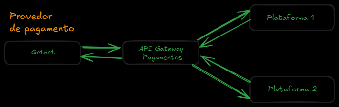

# API Getnet

Esta API tem por objetivo implementar os meios de pagamento da **Getnet**.

Abaixo está a documentação necessária para configuração em ambiente de produção.

---

## 🏗️Arquitetura



---

> ⚠️**Atenção*: Todos os dados sensíveis serão inseridos através de **variáveis de ambiente**, seguindo boas práticas de segurança.

---

##  📁 Configurações
As configurações da _**API da Getnet**_ estão organizadas da seguinte forma:
-  🔧 **Ambiente de Desenvolvimento**: [`appsettings.Development.json`](appsettings.Development.json)
-  🚀 **Ambiente de produção**: [`appsettings.json`](appsettings.json)
-  🌍 **Definir ambiente ativo  (dev/prod)**: [`launchSettings.json`](Properties/launchSettings.json)

---

A definição do ambiente ativo é feita no arquivo `launchSettings.json`, através da variável de ambiente `ASPNETCORE_ENVIRONMENT`.


## 💻 Exemplo em  produção
```json
"environmentVariables": {
  "ASPNETCORE_ENVIRONMENT": "Production"
}

```


## 💻 Exemplo em  desenvolvimento
```json
"environmentVariables": {
  "ASPNETCORE_ENVIRONMENT": "Development"
}

```

---

## 🔐 Configurações obrigatórias (`appsettings.json` e `appsettings.Development.json`)

Nos arquivos de configuração, é necessário incluir a seção `GetNet` com os dados de autenticação e identificação da aplicação junto à GetNet:

```json
"GetNet": {
  "ClientId": "SeuClientIdAqui",
  "ClientSecret": "SeuClientSecretAqui",
  "HostProducao": "api.getnet.com.br",
  "SellerId": "SeuSellerIdAqui",
  "GatewayId": "SeuGatewayIdAqui"
}

```

---

## 🛠️ Instalação

Para restaurar os pacotes e dependências do projeto, execute o comando abaixo no terminal:

```bash
dotnet restore
```

---

## 📌 Endpoints Disponíveis

- `POST /api/ProcessPayment/generate-token` - Gera um token para autenticação da aplicação.
- `POST /api/ProcesssPayment/generate-token-card` - Gera um token de cartão com base nos dados fornecidos.
- `POST /api/ProcessPayment/transact` - Realiza uma transação de pagamento com os dados informados.

---

## ✅ Testes

Você pode testar os endpoints das seguintes formas:

- **Swagger UI**: A interface de testes do swagger será aberta automaticamente ao iniciar a API. Ela permite enviar requisições e visualizar respostas diretamente no navegador.

- **Ferramentas externas**: Também é possível utilizar ferramentas como:
  - [Postman](https://www.postman.com/)
  - [Insomnia](https://insomnia.rest/)
  - [Rest Client](https://marketplace.visualstudio.com/items?itemName=humao.rest-client) (extensão para **VSCode**)
  
Essas ferramentas permitem testes manuais mais avançados, como envio de tokens, cabeçalhos personalizados, entre outros.
